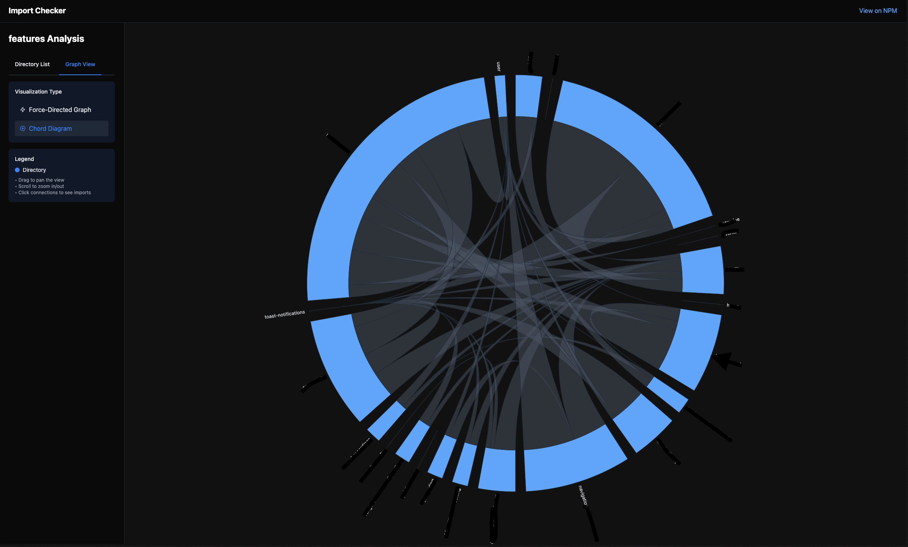
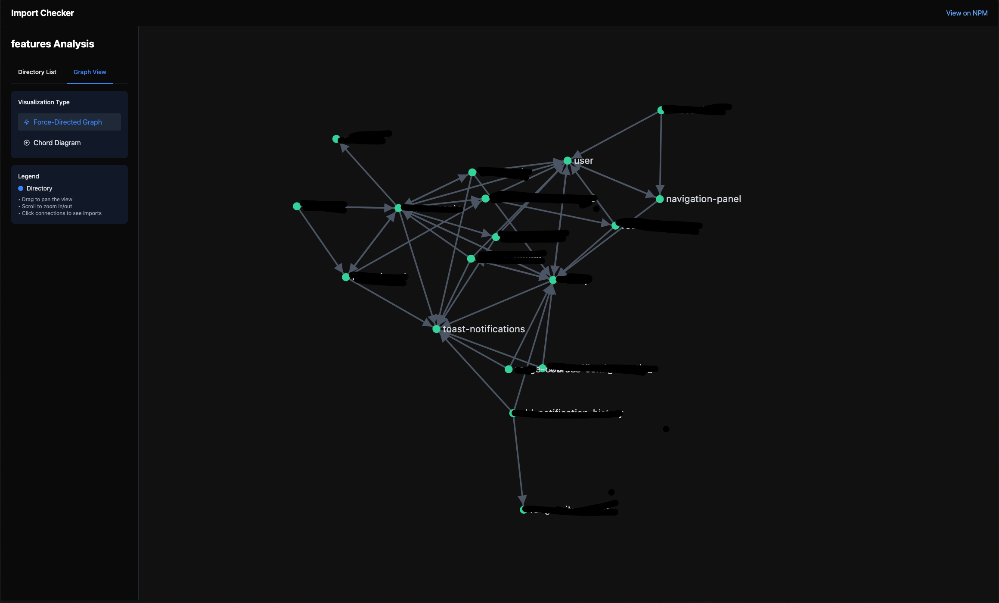

# Import Checker CLI

A command-line tool to analyze and maintain clean architecture in React/Next.js projects by checking cross-directory imports and component organization.

## Quick Overview

### Key Features

- Analyze imports between sibling directories
- Generate detailed HTML and JSON reports
- Support for JavaScript, TypeScript, JSX, and TSX files
- VS Code integration
- Enforce component directory structure

### Installation

```bash
# Global installation
npm install -g import-checker

# Local project installation
npm install --save-dev import-checker
```

## Core Commands

### 1. Single Directory Import Analysis

```bash
# Basic usage
import-checker check <directory>

# Example
import-checker check src/features/user

# Options
-v, --verbose     Show detailed output
--no-html         Skip HTML report generation
```

### 2. Sibling Directories Analysis

```bash
# Analyze all sibling directories
import-checker check-siblings <parent-directory>

# Example
import-checker check-siblings src/pages

# Options
-v, --verbose     Show detailed output
--no-html         Skip HTML report generation
```

### 3. Structure Checker

```bash
# Check component directory structure
import-checker check-structure <directory>

# Example
import-checker check-structure src/features

# Options
-s, --skip <directories>   Skip specific directories
-v, --verbose              Show detailed output
--no-html                  Skip HTML report generation
```

## Configuration

Create a `.importcheckerrc.json` in your project root:

```json
{
  "baseUrl": ".",
  "outputDir": "./import-analysis",
  "aliases": {
    "@/*": "src/*",
    "@components/*": "src/components/*"
  }
}
```

### Configuration Options

- `baseUrl`: Base directory for resolving aliases (default: ".")
- `outputDir`: Directory for saving analysis reports
- `aliases`: Map import aliases to actual paths

## Reports

### HTML Reports

- Interactive tree view
- Import counts
- Detailed file information
- VS Code file links

### JSON Reports

- Detailed import analysis
- Timestamp
- Total import statistics

## Use Cases

- Feature isolation
- Code organization
- Dependency management
- Architectural compliance

## Visualization




## Contributing

Contributions welcome! Please submit a Pull Request.

## License

MIT

## Support

Report issues on the GitHub issue tracker.
